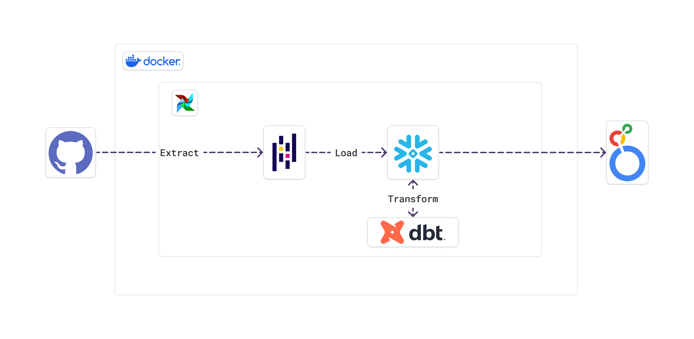
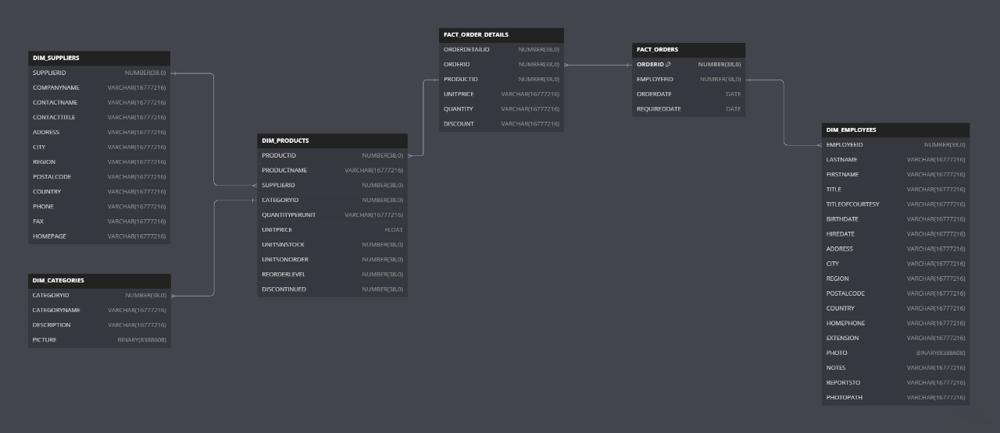

# Orchestrator-Airflow-ELT


# ERD-Datawarehouse


## Pre-requisites
1. Build docker image for Airflow
```bash
docker build -t dataninja/airflow -f ./docker/Dockerfile.airflow .
```
2. Create networks for Docker
```bash
docker network create -d bridge dataninja-networks
```
3. Setup file .env
```zsh
SOURCE=https://raw.githubusercontent.com/graphql-compose/graphql-compose-examples/master/examples/northwind/data/csv

# AIRFLOW ATTRIBUTES
AIRFLOW_CONTAINER_WEBSERVER=airflow-webserver
AIRFLOW_CONTAINER_SCHEDULER=airflow-scheduler
AIRFLOW_PORT=8080

# POSTGRES ATTRIBUTES
POSTGRES_CONTAINER=postgres
POSTGRES_DB=<Your-Database-Name>
POSTGRES_USER=<Your-User-Name>
POSTGRES_PASSWORD=<Your-User-Password>
POSTGRES_PORT=5432

# SNOWFLAKE ATTRIBUTES
SNOWFLAKE_USER=<Your-User-Name>
SNOWFLAKE_PASSWORD=<Your-User-Password>
SNOWFLAKE_ACCOUNT=<Your-Snowflake-Account>
SNOWFLAKE_DATABASE=<Your-Database-Name>
SNOWFLAKE_SCHEMA=<Your-Schema-Name>
SNOWFLAKE_WAREHOUSE=<Your-Warehouse-Name>
SNOWFLAKE_ROLE=<Your-Role-Name>
```
## How to use
Running Airflow with `docker-compose`
```bash
docker-compose -f ./docker/docker-compose.yml --env-file .env up -d
```

# Final-Result
You can find it in [CHECK-THE-FINAL-RESULT-HERE](result)
